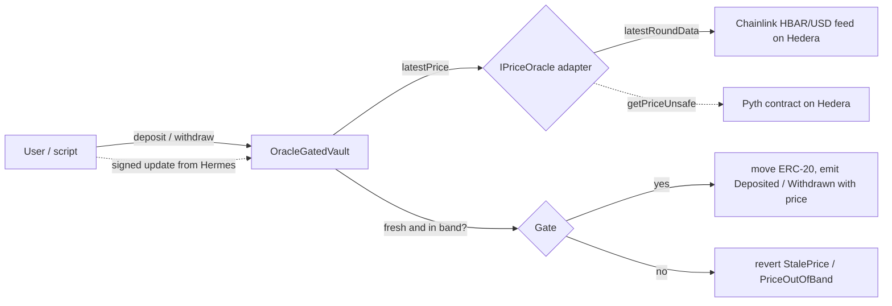

# Oracle-gated Vault — a Scaffold-HBAR template

An ERC-20 vault on Hedera whose **deposits and withdrawals only open while a live oracle price is fresh and inside a configured band**. On Hedera it reads the **Chainlink HBAR/USD Data Feed** through a small adapter; a **Pyth pull-oracle adapter** (post a signed Hermes update and act on it in the same transaction) ships alongside it behind the same interface.

```bash
npm create scaffold-hbar@latest -- --template inunanba/oracle-gated-vault
```

Use it as the starting point for anything that should only move money at a sane price: price-floor treasuries, stablecoin mint/redeem guards, collateral deposits, circuit-breaker vaults, "only rebalance between $X and $Y" strategies.

| | |
|---|---|
| Ecosystem integration | **Chainlink Data Feeds** on Hedera (HBAR/USD, push) by default · **Pyth** (HBAR/USD, pull via Hermes) as an alternative adapter |
| Hedera service | Solidity smart contracts on Hedera (HSCS) via JSON-RPC relay; HashScan + Mirror Node for proof |
| Stack | Next.js App Router · Hardhat + hardhat-deploy · wagmi/viem · npm workspaces · Node ≥ 20.18.3 |
| Licence | MIT |


---

## Contents

- [Quick start](#quick-start)
- [What you get](#what-you-get)
- [How it works](#how-it-works)
- [Deploy to Hedera testnet](#deploy-to-hedera-testnet)
- [Deployed on testnet](#deployed-on-testnet)
- [Environment variables](#environment-variables)
- [Scripts](#scripts)
- [Project layout](#project-layout)
- [Contract reference](#contract-reference)
- [Hedera gotchas this template handles](#hedera-gotchas-this-template-handles)
- [Make it yours](#make-it-yours)
- [Testing](#testing)
- [Security model and limitations](#security-model-and-limitations)
- [Troubleshooting](#troubleshooting)
- [Working with AI agents](#working-with-ai-agents)

---

## Quick start

Prerequisites: Node.js ≥ 20.18.3, npm ≥ 9, git. No keys are needed for anything in this section.

```bash
npm create scaffold-hbar@latest -- --template inunanba/oracle-gated-vault
cd <your-project>

npm run hardhat:compile
npm run hardhat:test          # 41 unit tests, in-memory chain, ~3 s
npm run next:dev              # http://localhost:3000/vault
```

The frontend ships with the addresses of the public testnet deployment (see [Deployed on testnet](#deployed-on-testnet)), so `/vault` works against Hedera testnet immediately: connect a wallet on Hedera Testnet, press **Get 100 demo HTK**, **Approve**, **Deposit**.

### Fully local (no testnet at all)

```bash
npm run hardhat:chain                              # terminal 1: Hardhat node on :8545 (forks Hedera testnet state)
npm run hardhat:deploy -- --network localhost      # terminal 2: HederaToken + MockPriceOracle + OracleGatedVault
npm run next:dev                                   # terminal 3, then pick "Hedera Local Fork" in the wallet menu
```

Locally the vault reads `MockPriceOracle`. Open **Debug Contracts**, call `MockPriceOracle.setPrice(50000000)` ($0.50) and watch deposits revert with `PriceOutOfBand`; set it back to `100000000` and they go through.

## What you get

- `/vault` — live Chainlink HBAR/USD price read straight from Hedera, on-chain gate status (oracle price, age, band, OPEN/CLOSED, total deposits), and a faucet/approve/deposit/withdraw panel. Shows deploy instructions when no vault exists on the selected network.
- `/debug` — Scaffold-HBAR's contract debugger for every deployed contract.
- `/blockexplorer` — local block explorer for the Hardhat chain.
- `packages/hardhat/scripts/e2eTestnet.ts` — runs faucet → approve → gated deposit → gated withdraw on testnet and prints a HashScan link for every transaction (with Pyth it posts a Hermes update in each gated call).

## How it works



**Why the oracle is load-bearing.** Every state-changing user path calls `requirePriceInBand()`. With no fresh, in-band price the vault is closed, both ways, and each `Deposited` / `Withdrawn` event records the price it was admitted at. Remove the oracle and the template has no reason to exist.

**Push vs pull, both covered.**

| | Chainlink (default on Hedera) | Pyth (optional) |
|---|---|---|
| Model | Push: Chainlink nodes write rounds on deviation or heartbeat | Pull: anyone posts a signed Hermes update, paying a 1-tinybar fee |
| Vault call | `deposit` / `withdraw` | `depositWithPriceUpdate` / `withdrawWithPriceUpdate` (update + action in one tx, excess fee refunded) |
| Staleness default | 90 000 s (24 h heartbeat + 1 h) | 60 s (price is posted in the same tx) |
| Keys needed | none | `PYTH_API_KEY` (Hermes requires one since the Pyth Core upgrade of 26 Aug 2026) |

**Layers.**

| Layer | File | Responsibility |
|---|---|---|
| Gate + accounting | `contracts/vault/OracleGatedVault.sol` | balances, band/staleness checks, optional in-tx pull update with refund |
| Oracle interfaces | `contracts/oracle/IPriceOracle.sol`, `IUpdatablePriceOracle.sol` | 8-decimal price + timestamp; optional pull-update hooks |
| Chainlink adapter | `contracts/oracle/ChainlinkPriceOracle.sol` | decimals normalisation, rejects answer ≤ 0 and incomplete rounds |
| Pyth adapter | `contracts/oracle/PythPriceOracle.sol` | exponent normalisation, rejects price ≤ 0 and confidence > `maxConfidenceBps`, exact-fee updates |
| Local oracle | `contracts/oracle/MockPriceOracle.sol` | owner-set price for offline development |
| Network config | `packages/hardhat/config/oracle.ts` | feed addresses, provider selection, band defaults |
| UI | `packages/nextjs/app/vault/` | `LiveFeedPrice`, `GateStatus`, `VaultActions` |

The vault only knows `IPriceOracle`, so swapping feeds is a new adapter plus `setOracle(adapter)` — no vault changes. See [docs/ORACLE_ADAPTERS.md](docs/ORACLE_ADAPTERS.md).

## Deploy to Hedera testnet

1. **Create a deployer key** (stored encrypted in `packages/hardhat/.env`, never committed):
   ```bash
   npm run hardhat:account:generate      # or hardhat:account:import for an existing ECDSA key
   npm run hardhat:account               # shows the EVM address and balance
   ```
2. **Fund it**: paste the EVM address into the [Hedera faucet](https://portal.hedera.com/faucet). The first transfer auto-creates a Hedera account for that address. A full deploy + e2e run costs about 3–4 testnet HBAR.
3. **Deploy** (HederaToken, ChainlinkPriceOracle on the live HBAR/USD feed, OracleGatedVault):
   ```bash
   npm run hardhat:deploy -- --network hederaTestnet
   ```
   The script prints HashScan links and regenerates `packages/nextjs/contracts/deployedContracts.ts`, so the frontend picks the new addresses up automatically.
   For the Pyth adapter instead: `ORACLE_PROVIDER=pyth PYTH_API_KEY=... npm run hardhat:deploy -- --network hederaTestnet`.
4. **Prove it end to end** (faucet, approve, gated deposit and withdraw, HashScan link per step):
   ```bash
   npm run hardhat:e2e:testnet
   ```
5. **Verify source** on Sourcify (HashScan shows the verified badge):
   ```bash
   npm run hardhat:verify -- --network hederaTestnet <vault-address> <constructor args…>
   ```

Mainnet works the same with `--network hederaMainnet`; the mainnet Chainlink feed address is already in `config/oracle.ts`.

## Deployed on testnet

<!-- TESTNET_PROOF:START -->
_Pending: filled in by the testnet deploy run (contract addresses and HashScan links for the deploy, gated deposit and gated withdraw transactions)._
<!-- TESTNET_PROOF:END -->

## Environment variables

`packages/hardhat/.env` (copy from `.env.example`; all optional except the deployer key for live networks):

| Variable | Default | Purpose |
|---|---|---|
| `DEPLOYER_PRIVATE_KEY_ENCRYPTED` | — | Written by `account:generate` / `account:import`. Never edit by hand. |
| `HEDERA_RPC_URL` | `https://testnet.hashio.io/api` | Relay used for forking the local chain |
| `ORACLE_PROVIDER` | `chainlink` | `chainlink` (push) or `pyth` (pull) for Hedera deploys |
| `CHAINLINK_FEED_ADDRESS` | HBAR/USD per network | Any Chainlink feed on Hedera |
| `PYTH_API_KEY` | — | Pyth Terminal key; required by Hermes for the Pyth path |
| `PYTH_CONTRACT_ADDRESS` | `0xA2aa501b19aff244D90cc15a4Cf739D2725B5729` | Pyth contract (testnet and mainnet) |
| `PYTH_PRICE_FEED_ID` | HBAR/USD `0x3728…dfbd` | Any [Pyth feed id](https://www.pyth.network/developers/price-feed-ids) |
| `PYTH_MAX_CONFIDENCE_BPS` | `200` | Reject prices whose confidence interval is wider than 2% |
| `PYTH_HERMES_URL` | `https://pyth.dourolabs.app/hermes` | Hermes endpoint used by scripts |
| `VAULT_MIN_PRICE` / `VAULT_MAX_PRICE` | `1000000` / `100000000` on Hedera ($0.01 / $1.00) | Band, 8 decimals |
| `VAULT_MAX_STALENESS` | `90000` Chainlink, `60` Pyth, `3600` local | Seconds an oracle price stays valid |
| `E2E_AMOUNT` | `10` | HTK amount used by `hardhat:e2e:testnet` |

`packages/nextjs/.env` (copy from `.env.example`):

| Variable | Default | Purpose |
|---|---|---|
| `NEXT_PUBLIC_HEDERA_TESTNET_RPC_URL` / `..._MAINNET_RPC_URL` | hashio | RPC overrides |
| `NEXT_PUBLIC_WALLET_CONNECT_PROJECT_ID` | Scaffold default | Get your own at cloud.reown.com for production |

## Scripts

| Command | What it does |
|---|---|
| `npm run hardhat:compile` / `hardhat:test` / `hardhat:test:gas` | Compile, unit tests, tests with gas report |
| `npm run hardhat:chain` | Local Hardhat node forking Hedera testnet (HTS emulation via `@hashgraph/system-contracts-forking`) |
| `npm run hardhat:deploy -- --network <localhost\|hederaTestnet\|hederaMainnet>` | Deploy and regenerate frontend ABIs |
| `npm run hardhat:e2e:testnet` | Live faucet → approve → gated deposit → gated withdraw, prints HashScan links |
| `npm run hardhat:account[:generate\|:import]` | Manage the encrypted deployer key |
| `npm run hardhat:verify -- --network hederaTestnet <address> <args>` | Sourcify verification |
| `npm run next:dev` / `next:build` / `next:serve` | Frontend |
| `npm run lint` / `npm run format` / `npm run next:check-types` | Quality gates |

## Project layout

```
packages/
  hardhat/
    contracts/
      vault/OracleGatedVault.sol      gate + accounting
      oracle/IPriceOracle.sol         8-decimal price interface
      oracle/IUpdatablePriceOracle.sol pull-oracle extension
      oracle/ChainlinkPriceOracle.sol Chainlink adapter (default on Hedera)
      oracle/PythPriceOracle.sol      Pyth adapter (pull)
      oracle/interfaces/              AggregatorV3Interface
      oracle/MockPriceOracle.sol      local oracle
      mocks/                          MockAggregatorV3, Pyth's MockPyth for tests
      HederaToken.sol                 demo ERC-20 asset with a public faucet()
    config/oracle.ts                  feed addresses, provider, band defaults
    deploy/00_deploy_hedera_token.ts
    deploy/01_deploy_oracle_gated_vault.ts  Chainlink/Pyth on Hedera, mock elsewhere
    scripts/e2eTestnet.ts             live end-to-end run
    scripts/runHardhatWithPK.ts       decrypts the deployer key for deploy/run
    utils/hermes.ts, utils/hashscan.ts
    test/                             vault, Chainlink, Pyth and token tests
  nextjs/
    app/vault/                        page + LiveFeedPrice, GateStatus, VaultActions
    utils/oracle/chainlink.ts         feed addresses + ABI
    contracts/deployedContracts.ts    generated by deploy
docs/
  ORACLE_ADAPTERS.md                  Chainlink + Pyth details, adding Supra or your own feed
template.json                         create-scaffold-hbar manifest
AGENTS.md                             instructions for coding agents
```

## Contract reference

`OracleGatedVault`

| Function | Notes |
|---|---|
| `deposit(amount)` / `withdraw(amount)` | Use the price already stored in the oracle |
| `depositWithPriceUpdate(amount, bytes[] update)` payable | Posts the update (pays `getUpdateFee`), refunds excess value, then deposits |
| `withdrawWithPriceUpdate(amount, bytes[] update)` payable | Same for withdrawals |
| `previewGate() → (price, updatedAt, fresh, inBand)` | Non-reverting status for UIs |
| `requirePriceInBand() → price` | Reverting check used by every user action |
| `getUpdateFee(bytes[] update)` | Fee in tinybars |
| `setBand(min, max, maxStaleness)` / `setOracle(addr)` | `onlyOwner` |

Events: `Deposited(user, amount, price)`, `Withdrawn(user, amount, price)`, `PriceRefreshed(caller, fee)`, `BandUpdated`, `OracleUpdated`.
Errors: `PriceOutOfBand(price, min, max)`, `StalePrice(updatedAt, maxStaleness)`, `InsufficientUpdateFee(sent, required)`, `WithdrawExceedsBalance(requested, available)`, `UnexpectedValue`, `ZeroAmount`, `ZeroAddress`, `InvalidBand`.

`ChainlinkPriceOracle(feed, decimals)` — `latestPrice()` returns the latest round scaled to `decimals` with the round's `updatedAt`; reverts `NonPositivePrice` / `IncompleteRound`.

`PythPriceOracle(pyth, priceId, decimals, maxConfidenceBps)` — `latestPrice()` normalises any Pyth exponent to `decimals`, reverts with `NonPositivePrice` or `ConfidenceTooWide`; `updatePrice(update)` requires exactly the Pyth fee (`IncorrectUpdateFee`).

## Hedera gotchas this template handles

- **Tinybars vs weibars.** Inside the EVM, `msg.value` and Pyth's `getUpdateFee` are in tinybars (8 decimals). Wallets and the JSON-RPC relay send weibars (18 decimals). The Pyth path multiplies the fee by `10^10` (`TINYBAR_TO_WEIBAR`); sending the raw fee (1 wei) is below one tinybar, so the contract would see zero and revert with `InsufficientUpdateFee`.
- **Testnet feed cadence.** Chainlink testnet feeds publish on deviation or heartbeat, so `maxStaleness` defaults to 25 h for the push path. `previewGate()` reports stale prices instead of reverting so the UI can explain why the vault is closed.
- **Pyth on Hedera after the Aug 2026 Pyth Core upgrade.** Hermes now needs an API key, and the HBAR/USD slot of the Hedera Pyth contract has not been refreshed since 24 Aug 2026. That is why Chainlink is the default and the Pyth adapter is opt-in.
- **Gas limit is charged.** Hedera charges at least 80% of the gas limit, so deploy, e2e and UI calls set explicit, measured limits instead of padded defaults.
- **Hollow accounts.** Funding a fresh EVM address from the faucet creates a hollow account; the first transaction signed by that key (the deploy) completes it. No Hedera SDK step is needed.
- **Unit tests do not depend on the relay.** The Hardhat network forks Hedera only when `HEDERA_FORKING=true` (`hardhat:chain`), so `hardhat:test` is deterministic and offline. Feeds are exercised with `MockAggregatorV3` and Pyth's own `MockPyth`.

## Make it yours

- **Different asset**: pass your token to the vault constructor in `deploy/01_deploy_oracle_gated_vault.ts`. For an HTS token use its ERC-20 facade address and associate the vault with the token before the first deposit.
- **Different feed or band**: set `CHAINLINK_FEED_ADDRESS` (or `PYTH_PRICE_FEED_ID`) and `VAULT_MIN_PRICE` / `VAULT_MAX_PRICE` (8 decimals) before deploying; update `utils/oracle/chainlink.ts` for the UI card. Retune later with `setBand`.
- **Different oracle**: implement `IPriceOracle` (and `IUpdatablePriceOracle` for pull oracles), deploy, call `setOracle`. A Supra sketch is in [docs/ORACLE_ADAPTERS.md](docs/ORACLE_ADAPTERS.md).
- **Different gate**: the check lives in one function, `requirePriceInBand()`. Gate only deposits, use Pyth's EMA price, or require Chainlink and Pyth to agree within a tolerance.

## Testing

```bash
npm run hardhat:test
```

41 tests cover: in-band/out-of-band/stale deposits and withdrawals, withdrawals blocked while out of band, `previewGate`, owner-only admin and input validation; Chainlink decimals scaling (up and down), non-positive answers, incomplete rounds, missed heartbeat, band re-opening on a new round; Pyth exponent scaling, negative price and wide-confidence rejection, exact update fee, deposit-with-update in one transaction, refund of excess fee, insufficient fee, stale publish time, withdraw-with-update after the stored price went stale; demo token faucet. `npm run hardhat:e2e:testnet` is the live counterpart against the real Chainlink feed.

## Security model and limitations

- **Withdrawals are gated too.** That is the point of the template, but it means users cannot exit while the price is out of band or the feed is stale. For real funds add an owner- or time-locked emergency exit, or gate only deposits.
- **The owner can change the band and the oracle.** Put the vault behind a multisig/timelock in production.
- **Demo asset.** `HederaToken.faucet()` lets anyone mint 100 HTK so visitors can try the public deployment. Remove it for a real asset.
- **Staleness and confidence are per-deployment choices.** Defaults (25 h for Chainlink, 60 s and 2% for Pyth) suit a demo, not every market. A single oracle is a single point of failure; production vaults often require two sources to agree.
- Not audited.

## Troubleshooting

| Symptom | Fix |
|---|---|
| `StalePrice` | The feed has not published within `maxStaleness`. Check the feed's last round on `/vault` (or HashScan) and widen with `setBand` if your feed's heartbeat is longer. With Pyth, use `depositWithPriceUpdate` |
| `InsufficientUpdateFee(0, 1)` | Pyth path: the fee was sent in tinybars; multiply by `10^10` (weibars) when sending |
| `Hermes request failed: 401` | Pyth path: set `PYTH_API_KEY` (Pyth Terminal) |
| `PriceOutOfBand` | HBAR/USD is outside the band; check `/vault` and adjust with `setBand` |
| `ConfidenceTooWide` | Pyth path: confidence exceeds `maxConfidenceBps`; wait or redeploy the adapter with a wider limit |
| `npm run hardhat:deploy --network hederaTestnet` deploys to the wrong network | npm swallows flags before `--`; use `npm run hardhat:deploy -- --network hederaTestnet` |
| Deploy fails with `INSUFFICIENT_PAYER_BALANCE` | Fund the deployer address from the faucet; `npm run hardhat:account` shows the balance |
| `/vault` says "No vault deployed" | Select the network you deployed to in the wallet menu, or redeploy so `deployedContracts.ts` is regenerated |

## Working with AI agents

[AGENTS.md](AGENTS.md) (loaded by Claude Code via `CLAUDE.md`, and by Cursor/Codex directly) describes the architecture, the invariants to keep, and the commands to validate a change. `.agents/` and `.claude/` include a Solidity security skill and a reviewer agent from Scaffold-HBAR. This template was not built with Hedera Harness.

## License

MIT — see [LICENSE](LICENSE). Built on [Scaffold-HBAR](https://github.com/hedera-dev/scaffold-hbar) (MIT).
