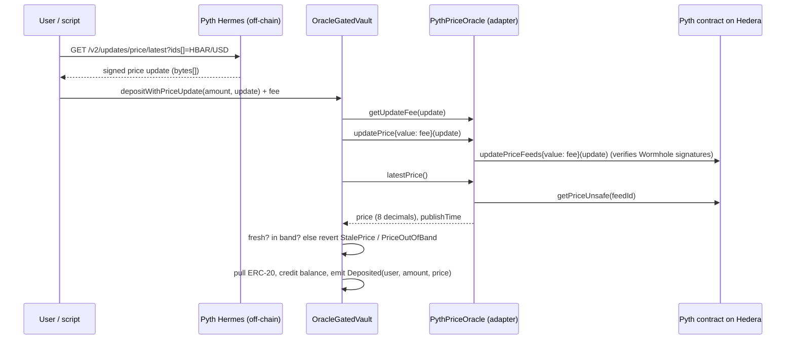

# Oracle-gated Vault — a Scaffold-HBAR template

An ERC-20 vault on Hedera whose **deposits and withdrawals only open while a live Pyth price is fresh and inside a configured band**. The template shows the complete pull-oracle pattern on Hedera: fetch a signed price from Pyth Hermes in the browser (or a script), verify it on-chain through the Pyth contract, and act on it in the same transaction.

```bash
npm create scaffold-hbar@latest -- --template inunanba/oracle-gated-vault
```

Use it as the starting point for anything that should only move money at a sane price: price-floor treasuries, stablecoin mint/redeem guards, collateral deposits, circuit-breaker vaults, "only rebalance between $X and $Y" strategies.

| | |
|---|---|
| Ecosystem integration | **Pyth Network** price feeds on Hedera (`0xA2aa…5B5729`, HBAR/USD), Hermes pull updates |
| Hedera service | Solidity smart contracts on Hedera (HSCS) via JSON-RPC relay; HashScan + Mirror Node for proof |
| Stack | Next.js App Router · Hardhat + hardhat-deploy · wagmi/viem · npm workspaces · Node ≥ 20.18.3 |
| Licence | MIT |


---

## Contents

- [Quick start](#quick-start)
- [What you get](#what-you-get)
- [How it works](#how-it-works)
- [Deploy to Hedera testnet](#deploy-to-hedera-testnet)
- [Deployed on testnet](#deployed-on-testnet)
- [Environment variables](#environment-variables)
- [Scripts](#scripts)
- [Project layout](#project-layout)
- [Contract reference](#contract-reference)
- [Hedera gotchas this template handles](#hedera-gotchas-this-template-handles)
- [Make it yours](#make-it-yours)
- [Testing](#testing)
- [Security model and limitations](#security-model-and-limitations)
- [Troubleshooting](#troubleshooting)
- [Working with AI agents](#working-with-ai-agents)

---

## Quick start

Prerequisites: Node.js ≥ 20.18.3, npm ≥ 9, git. No keys are needed for anything in this section.

```bash
npm create scaffold-hbar@latest -- --template inunanba/oracle-gated-vault
cd <your-project>

npm run hardhat:compile
npm run hardhat:test          # 33 unit tests, in-memory chain, ~3 s
npm run next:dev              # http://localhost:3000/vault
```

The frontend ships with the addresses of the public testnet deployment (see [Deployed on testnet](#deployed-on-testnet)), so `/vault` works against Hedera testnet immediately: connect a wallet on Hedera Testnet, press **Get 100 demo HTK**, **Approve**, **Deposit**.

### Fully local (no testnet at all)

```bash
npm run hardhat:chain                              # terminal 1: Hardhat node on :8545 (forks Hedera testnet state)
npm run hardhat:deploy -- --network localhost      # terminal 2: HederaToken + MockPriceOracle + OracleGatedVault
npm run next:dev                                   # terminal 3, then pick "Hedera Local Fork" in the wallet menu
```

Locally the vault reads `MockPriceOracle`. Open **Debug Contracts**, call `MockPriceOracle.setPrice(50000000)` ($0.50) and watch deposits revert with `PriceOutOfBand`; set it back to `100000000` and they go through.

## What you get

- `/vault` — live Pyth HBAR/USD price from Hermes, on-chain gate status (stored price, age, band, OPEN/CLOSED), and a deposit/withdraw panel that posts a fresh Pyth update with every action. Shows deploy instructions when no vault exists on the selected network.
- `/debug` — Scaffold-HBAR's contract debugger for every deployed contract.
- `/blockexplorer` — local block explorer for the Hardhat chain.
- `packages/hardhat/scripts/e2eTestnet.ts` — runs approve → deposit-with-update → withdraw-with-update on testnet and prints a HashScan link for every transaction.

## How it works



**Why the oracle is load-bearing.** Every state-changing user path calls `requirePriceInBand()`. With no fresh, in-band price the vault is closed, both ways. Pyth on Hedera is a *pull* oracle: the price stored on-chain is only as recent as the last update someone paid for (the HBAR/USD slot is often days old), so a template that only called `getPrice` would be permanently closed. The `*WithPriceUpdate` functions solve this by carrying the Hermes update inside the user's own transaction.

**Layers.**

| Layer | File | Responsibility |
|---|---|---|
| Gate + accounting | `contracts/vault/OracleGatedVault.sol` | balances, band/staleness checks, optional in-tx price update with refund of excess fee |
| Oracle interface | `contracts/oracle/IPriceOracle.sol`, `IUpdatablePriceOracle.sol` | 8-decimal price + timestamp; optional pull-update hooks |
| Pyth adapter | `contracts/oracle/PythPriceOracle.sol` | exponent normalisation, rejects price ≤ 0 and confidence > `maxConfidenceBps` |
| Local oracle | `contracts/oracle/MockPriceOracle.sol` | owner-set price for offline development |
| Network config | `packages/hardhat/config/oracle.ts` | Pyth address, feed id, band defaults per network |
| Frontend oracle client | `packages/nextjs/utils/oracle/pyth.ts` | Hermes fetch, tinybar→weibar fee scaling |
| UI | `packages/nextjs/app/vault/` | `LivePythPrice`, `GateStatus`, `VaultActions` |

The vault only knows `IPriceOracle`, so swapping Pyth for Supra, Chainlink or your own feed is a new adapter plus `setOracle(adapter)` — no vault changes. See [docs/ORACLE_ADAPTERS.md](docs/ORACLE_ADAPTERS.md).

## Deploy to Hedera testnet

1. **Create a deployer key** (stored encrypted in `packages/hardhat/.env`, never committed):
   ```bash
   npm run hardhat:account:generate      # or hardhat:account:import for an existing ECDSA key
   npm run hardhat:account               # shows the EVM address and balance
   ```
2. **Fund it**: paste the EVM address into the [Hedera faucet](https://portal.hedera.com/faucet). The first transfer auto-creates a Hedera account for that address. A full deploy + e2e run costs about 3–4 testnet HBAR.
3. **Deploy** (HederaToken, PythPriceOracle on the live Pyth contract, OracleGatedVault):
   ```bash
   npm run hardhat:deploy -- --network hederaTestnet
   ```
   The script prints HashScan links and regenerates `packages/nextjs/contracts/deployedContracts.ts`, so the frontend picks the new addresses up automatically.
4. **Prove it end to end** with a real Pyth update:
   ```bash
   npm run hardhat:e2e:testnet
   ```
5. **Verify source** on Sourcify (HashScan shows the verified badge):
   ```bash
   npm run hardhat:verify -- --network hederaTestnet <vault-address> <constructor args…>
   ```

Mainnet works the same with `--network hederaMainnet` and `HEDERA_RPC_URL=https://mainnet.hashio.io/api`; Pyth uses the same address there.

## Deployed on testnet

<!-- TESTNET_PROOF:START -->
_Pending: filled in by the testnet deploy run (contract addresses, HashScan links for deploy, deposit-with-Pyth-update and withdraw-with-Pyth-update transactions)._
<!-- TESTNET_PROOF:END -->

## Environment variables

`packages/hardhat/.env` (copy from `.env.example`; all optional except the deployer key for live networks):

| Variable | Default | Purpose |
|---|---|---|
| `DEPLOYER_PRIVATE_KEY_ENCRYPTED` | — | Written by `account:generate` / `account:import`. Never edit by hand. |
| `HEDERA_RPC_URL` | `https://testnet.hashio.io/api` | Relay used for forking the local chain |
| `PYTH_CONTRACT_ADDRESS` | `0xA2aa501b19aff244D90cc15a4Cf739D2725B5729` | Pyth contract (testnet and mainnet) |
| `PYTH_PRICE_FEED_ID` | HBAR/USD `0x3728…dfbd` | Any [Pyth feed id](https://www.pyth.network/developers/price-feed-ids) |
| `PYTH_MAX_CONFIDENCE_BPS` | `200` | Reject prices whose confidence interval is wider than 2% |
| `PYTH_HERMES_URL` | `https://hermes.pyth.network` | Hermes endpoint used by scripts |
| `VAULT_MIN_PRICE` / `VAULT_MAX_PRICE` | `1000000` / `100000000` on Hedera ($0.01 / $1.00) | Band, 8 decimals |
| `VAULT_MAX_STALENESS` | `60` on Hedera, `3600` locally | Seconds a stored price stays valid |
| `E2E_AMOUNT` | `10` | HTK amount used by `hardhat:e2e:testnet` |

`packages/nextjs/.env` (copy from `.env.example`):

| Variable | Default | Purpose |
|---|---|---|
| `NEXT_PUBLIC_PYTH_PRICE_FEED_ID` | HBAR/USD | Feed shown and pushed by the UI; must match the deployed oracle |
| `NEXT_PUBLIC_PYTH_HERMES_URL` | `https://hermes.pyth.network` | Hermes endpoint used by the browser |
| `NEXT_PUBLIC_HEDERA_TESTNET_RPC_URL` / `..._MAINNET_RPC_URL` | hashio | RPC overrides |
| `NEXT_PUBLIC_WALLET_CONNECT_PROJECT_ID` | Scaffold default | Get your own at cloud.reown.com for production |

## Scripts

| Command | What it does |
|---|---|
| `npm run hardhat:compile` / `hardhat:test` / `hardhat:test:gas` | Compile, unit tests, tests with gas report |
| `npm run hardhat:chain` | Local Hardhat node forking Hedera testnet (HTS emulation via `@hashgraph/system-contracts-forking`) |
| `npm run hardhat:deploy -- --network <localhost\|hederaTestnet\|hederaMainnet>` | Deploy and regenerate frontend ABIs |
| `npm run hardhat:e2e:testnet` | Live approve → deposit → withdraw with Pyth updates, prints HashScan links |
| `npm run hardhat:account[:generate\|:import]` | Manage the encrypted deployer key |
| `npm run hardhat:verify -- --network hederaTestnet <address> <args>` | Sourcify verification |
| `npm run next:dev` / `next:build` / `next:serve` | Frontend |
| `npm run lint` / `npm run format` / `npm run next:check-types` | Quality gates |

## Project layout

```
packages/
  hardhat/
    contracts/
      vault/OracleGatedVault.sol      gate + accounting
      oracle/IPriceOracle.sol         8-decimal price interface
      oracle/IUpdatablePriceOracle.sol pull-oracle extension
      oracle/PythPriceOracle.sol      Pyth adapter
      oracle/MockPriceOracle.sol      local oracle
      mocks/PythMockImport.sol        compiles Pyth's MockPyth for tests
      HederaToken.sol                 demo ERC-20 asset with a public faucet()
    config/oracle.ts                  Pyth address, feed id, band defaults
    deploy/00_deploy_hedera_token.ts
    deploy/01_deploy_oracle_gated_vault.ts  Pyth on Hedera, mock elsewhere
    scripts/e2eTestnet.ts             live end-to-end run
    scripts/runHardhatWithPK.ts       decrypts the deployer key for deploy/run
    utils/hermes.ts, utils/hashscan.ts
    test/                             OracleGatedVault, PythPriceOracle, HederaToken
  nextjs/
    app/vault/                        page + LivePythPrice, GateStatus, VaultActions
    utils/oracle/pyth.ts              Hermes client, fee scaling
    contracts/deployedContracts.ts    generated by deploy
docs/
  ORACLE_ADAPTERS.md                  Pyth details, adding Supra/Chainlink adapters
template.json                         create-scaffold-hbar manifest
AGENTS.md                             instructions for coding agents
```

## Contract reference

`OracleGatedVault`

| Function | Notes |
|---|---|
| `deposit(amount)` / `withdraw(amount)` | Use the price already stored in the oracle |
| `depositWithPriceUpdate(amount, bytes[] update)` payable | Posts the update (pays `getUpdateFee`), refunds excess value, then deposits |
| `withdrawWithPriceUpdate(amount, bytes[] update)` payable | Same for withdrawals |
| `previewGate() → (price, updatedAt, fresh, inBand)` | Non-reverting status for UIs |
| `requirePriceInBand() → price` | Reverting check used by every user action |
| `getUpdateFee(bytes[] update)` | Fee in tinybars |
| `setBand(min, max, maxStaleness)` / `setOracle(addr)` | `onlyOwner` |

Events: `Deposited(user, amount, price)`, `Withdrawn(user, amount, price)`, `PriceRefreshed(caller, fee)`, `BandUpdated`, `OracleUpdated`.
Errors: `PriceOutOfBand(price, min, max)`, `StalePrice(updatedAt, maxStaleness)`, `InsufficientUpdateFee(sent, required)`, `WithdrawExceedsBalance(requested, available)`, `UnexpectedValue`, `ZeroAmount`, `ZeroAddress`, `InvalidBand`.

`PythPriceOracle(pyth, priceId, decimals, maxConfidenceBps)` — `latestPrice()` normalises any Pyth exponent to `decimals`, reverts with `NonPositivePrice` or `ConfidenceTooWide`; `updatePrice(update)` requires exactly the Pyth fee (`IncorrectUpdateFee`).

## Hedera gotchas this template handles

- **Tinybars vs weibars.** Inside the EVM, `msg.value` and Pyth's `getUpdateFee` are in tinybars (8 decimals). Wallets and the JSON-RPC relay send weibars (18 decimals). The UI and scripts multiply the fee by `10^10` (`TINYBAR_TO_WEIBAR`); sending the raw fee (1 wei) is below one tinybar, so the contract would see zero and revert with `InsufficientUpdateFee`.
- **Pull oracle staleness.** The stored Pyth price on Hedera testnet can be weeks old. `previewGate()` reports it as stale instead of reverting, and the action buttons always carry a fresh update. `maxStaleness` defaults to 60 s on Hedera because the price is posted in the same transaction.
- **Gas limit is charged.** Hedera charges at least 80% of the gas limit, so deploy and e2e scripts set explicit, measured limits instead of padded defaults.
- **Hollow accounts.** Funding a fresh EVM address from the faucet creates a hollow account; the first transaction signed by that key (the deploy) completes it. No Hedera SDK step is needed.
- **Unit tests do not depend on the relay.** The Hardhat network forks Hedera only when `HEDERA_FORKING=true` (`hardhat:chain`), so `hardhat:test` is deterministic and offline. Pyth is exercised with Pyth's own `MockPyth`.

## Make it yours

- **Different asset**: pass your token to the vault constructor in `deploy/01_deploy_oracle_gated_vault.ts`. For an HTS token use its ERC-20 facade address and associate the vault with the token before the first deposit.
- **Different feed or band**: set `PYTH_PRICE_FEED_ID` and `VAULT_MIN_PRICE` / `VAULT_MAX_PRICE` (8 decimals) before deploying, and `NEXT_PUBLIC_PYTH_PRICE_FEED_ID` for the UI. Retune later with `setBand`.
- **Different oracle**: implement `IPriceOracle` (and `IUpdatablePriceOracle` for pull oracles), deploy, call `setOracle`. A Supra and a Chainlink sketch are in [docs/ORACLE_ADAPTERS.md](docs/ORACLE_ADAPTERS.md).
- **Different gate**: the check lives in one function, `requirePriceInBand()`. Gate only deposits, add a TWAP via Pyth EMA price, or require two oracles to agree.

## Testing

```bash
npm run hardhat:test
```

33 tests cover: in-band/out-of-band/stale deposits and withdrawals, withdrawals blocked while out of band, `previewGate`, owner-only admin and input validation, Pyth exponent scaling (up and down), negative price and wide-confidence rejection, exact update fee, deposit-with-update in one transaction, refund of excess fee, insufficient fee, stale Pyth publish time, and withdraw-with-update after the stored price went stale. `npm run hardhat:e2e:testnet` is the live counterpart against the real Pyth contract.

## Security model and limitations

- **Withdrawals are gated too.** That is the point of the template, but it means users cannot exit while the price is out of band or Pyth is unreachable. For real funds add an owner- or time-locked emergency exit, or gate only deposits.
- **The owner can change the band and the oracle.** Put the vault behind a multisig/timelock in production.
- **Demo asset.** `HederaToken.faucet()` lets anyone mint 100 HTK so visitors can try the public deployment. Remove it for a real asset.
- **Confidence and staleness are per-deployment choices.** Defaults (2%, 60 s) suit a demo, not every market.
- Not audited.

## Troubleshooting

| Symptom | Fix |
|---|---|
| `StalePrice` on plain `deposit` on testnet | Expected: use the UI buttons or `depositWithPriceUpdate`, which post a fresh Pyth update |
| `InsufficientUpdateFee(0, 1)` | The fee was sent in tinybars; multiply by `10^10` (weibars) when sending |
| `PriceOutOfBand` | HBAR/USD is outside the band; check `/vault` and adjust with `setBand` |
| `ConfidenceTooWide` | Pyth confidence exceeds `maxConfidenceBps`; wait or redeploy the adapter with a wider limit |
| `npm run hardhat:deploy --network hederaTestnet` deploys to the wrong network | npm swallows flags before `--`; use `npm run hardhat:deploy -- --network hederaTestnet` |
| Deploy fails with `INSUFFICIENT_PAYER_BALANCE` | Fund the deployer address from the faucet; `npm run hardhat:account` shows the balance |
| `/vault` says "No vault deployed" | Select the network you deployed to in the wallet menu, or redeploy so `deployedContracts.ts` is regenerated |

## Working with AI agents

[AGENTS.md](AGENTS.md) (loaded by Claude Code via `CLAUDE.md`, and by Cursor/Codex directly) describes the architecture, the invariants to keep, and the commands to validate a change. `.agents/` and `.claude/` include a Solidity security skill and a reviewer agent from Scaffold-HBAR. This template was not built with Hedera Harness.

## License

MIT — see [LICENSE](LICENSE). Built on [Scaffold-HBAR](https://github.com/hedera-dev/scaffold-hbar) (MIT).
